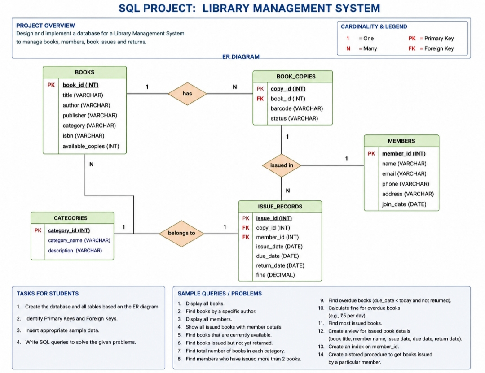

# Library-Operations-Data-Analytics
# Library Operations & Management Data Analytics

## 📌 Project Overview
This project focuses on designing and implementing a relational database system for a library management environment. Beyond basic data storage, the goal of this project is to model real-world business entity relationships, track historical asset movements, and uncover critical operational analytics (such as identifying inventory choke points and active user cohorts) using advanced SQL techniques.

## 🛠️ Tech Stack & Skills Used
* **Database Engine:** MySQL
* **SQL Concepts:** DDL/DML, Relational Constraints (`FOREIGN KEY`, `ON DELETE CASCADE`), Advanced Multi-table `JOIN` operations, Aggregations (`GROUP BY`, `HAVING`), Performance Indexing, `VIEWS`, and `STORED PROCEDURES`.

## 🗄️ Database Architecture

The schema models a robust data architecture tracking libraries, categorical allocations, assets, system members, and transactional histories:
* **CATEGORIES & BOOKS:** Hierarchical classification mapping out structural book inventory.
* **BOOK_COPIES:** Asset-level mapping allowing distinct individual copies of a single title to be tracked concurrently (e.g., 'Available' vs 'Issued').
* **MEMBERS:** Customer profiles tracking demographic and sign-up baselines.
* **ISSUE_RECORDS:** Transaction logs keeping track of timeline sequences, checkout frequencies, returns, and outstanding financial structures (fines).

## 📊 Business Metrics & Analytical Insights Addressed
The scripts contained in `03_analytical_queries.sql` resolve essential real-world operational challenges:
1. **Asset Management:** Identifies currently loaned inventory and extracts real-time actionable visibility on unreturned assets.
2. **Category Deep Dives:** Breaks down historical acquisition distributions to reveal skew variants toward specific learning niches.
3. **Churn & Engagement Risk:** Spotlights overdue records dynamically to prevent asset losses using system runtime functions (`CURDATE()`).
4. **Demand Planning:** Aggregates consumer histories to calculate the most frequently issued titles, optimizing future procurement budgets.

## ⚡ Performance & Scalability Enhancements
To demonstrate production-grade design principles, the database integrates structural scaling tools:
* **Views (`View_Issued_Book_Details`):** Abstracts multi-layer join complexities into clean virtual frames to simplify stakeholder reporting layers.
* **Indexing (`idx_member_id`):** Created a targeted B-Tree index on high-frequency operational lookup columns to optimize query speeds when scaling data to thousands of items.
* **Stored Procedures (`GetBooksIssuedByMember`):** Bundled parametrizing logic configurations to allow programmatic data retrieval safely and repeatedly.

## 🚀 How To Run This Project
1. Clone this repository locally.
2. Run the scripts in sequential order inside your SQL workbench client:
   * `/SQL_Scripts/01_schema_setup.sql`
   * `/SQL_Scripts/02_mock_data.sql`
   * `/SQL_Scripts/03_analytical_queries.sql`
   * `/SQL_Scripts/04_advanced_features.sql`
